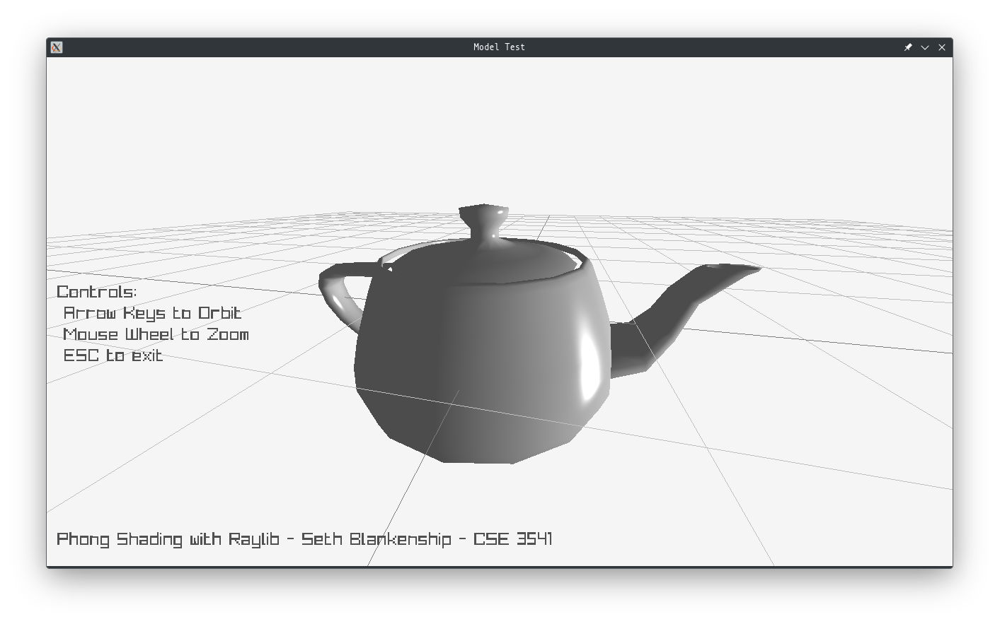

# Phong Shading for Lab 6 - CSE 3541

This is a simple implementation of Phong Shading as a Lab for Computer animation CSE 3451



### How to run this demo

First make sure that you have the following dependencies

- raylib
- OpenGL
- X11

#### Clone the repo

``` 
git clone https://github.com/no-budy/raylibPhongShading.git
```


#### Run make

``` 
cd raylibPhongShading
make
```
